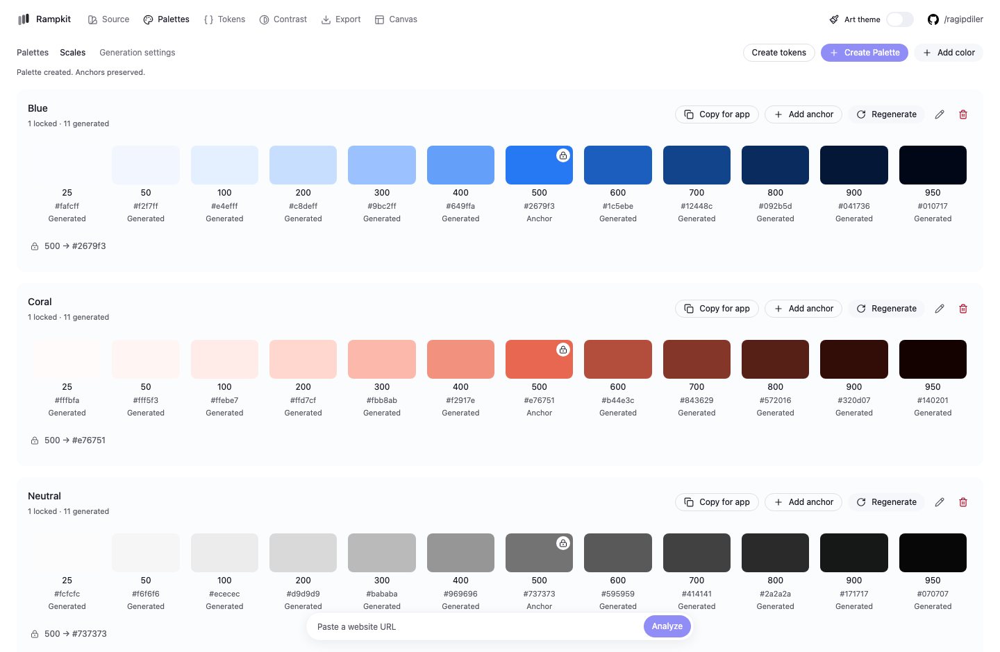
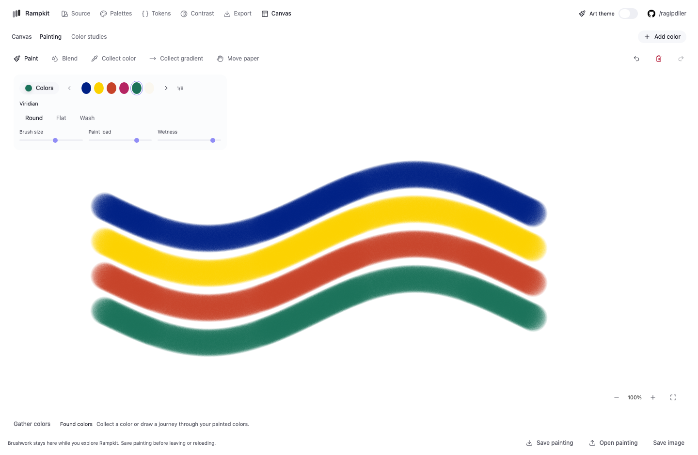

# Rampkit

Turn website colors into production-ready color systems.

Rampkit is an open-source, local-first color system builder for designers and developers. It extracts useful colors from websites or accepts custom colors, builds perceptually consistent OKLCH palettes, validates contrast, generates light and dark design tokens, and exports production-ready color systems.

## Overview

Rampkit runs on your machine. **No account required. No database required. No paid API required.** The color engine, browser extraction, and fonts run locally. Internet access is needed for installation and analyzing remote websites. Provided web scripts disable Next.js telemetry.

## Features

- Website color discovery with usage evidence; manual HEX, RGB, and OKLCH input.
- Editable 12-stop palettes with exact locked anchors and deterministic generation.
- Independent Light/Dark semantic mappings, searchable token selections, and component previews.
- Contrast ratios and suggestions using existing colors.
- CSS, JSON, Tailwind CSS v4, and W3C-style token exports.
- Copy-ready integration prompts for Codex, Claude Code, and VS Code; no AI API calls.
- Infinite painting and color-study canvases, pigment mixing, sampled colors and gradients.
- Optional Art appearance, keyboard navigation, and a command palette.

## Screenshots





## Installation

Use **Node.js 22.13 or newer** (Node 22 or 24 LTS recommended) and npm.

```bash
git clone https://github.com/ragipdiler/rampkit.git
cd rampkit
npm install
npx playwright install chromium
```

On Linux, install Chromium's system libraries if needed:

```bash
npx playwright install --with-deps chromium
```

No `.env` file or service credentials are needed.

## Local development

```bash
npm run dev
```

Open [127.0.0.1:3000](http://127.0.0.1:3000). Development and production scripts bind to loopback by default. To choose another port, use `npm run dev -- --port 3001`.

```bash
npm run build
npm start
```

Validation:

```bash
npm run typecheck
npm run lint
npm test
npm run test:e2e
```

`npm run check` combines type checking, lint, and unit tests. Browser tests start the app and a local fixture; run them separately from an existing dev/production server and production builds. No external website is needed for the default suite.

## Usage

1. Add manual colors or analyze a website in **Source**.
2. Create named **Palettes** from chosen colors and assign anchor positions.
3. Choose **Create tokens**, then map semantic roles in **Tokens** for each theme.
4. Review component **Preview** and **Contrast**.
5. Copy/download in **Export**, or use **Tokens → Integrate** to prepare an app handoff.

The workspace is held in memory. Export before reloading or closing the tab. Painting and color studies have their own local save/open files. `Ctrl/⌘ K` opens commands; `Ctrl/⌘ 1–6` navigates views.

## Website color extraction

Paste a website URL into Analyze. Chromium reads rendered DOM styles, CSS variables, SVG colors, gradients, borders, and shadows. Source cards group repeated colors and alpha variants; the inspector retains original evidence.

Extraction discovers candidates, not a finished design system. You choose anchors and explicitly create palettes and tokens. Run extraction only on sites you trust and have permission to inspect; see [SECURITY.md](SECURITY.md) for network boundaries.

## Manual color workflow

Use **Add color**, or **Create Palette** with a HEX, RGB, or OKLCH anchor. A URL is optional. Edit a generated stop to turn it into an anchor; unlock it to allow regeneration.

Canvas supports brush painting, subtractive pigment mixing, sampling, and collecting gradients into new palettes. Mixing is an approximation, not a physical fluid simulation. Colors and gradients are saved only when you explicitly choose to collect/export them.

## Palette generation

Ramps use steps `25`, `50`, `100` through `900`, and `950`. Locked anchors preserve their normalized values. Unlocked stops are generated in OKLCH using configurable lightness, chroma, and hue behavior. Conflicting anchor order is reported rather than silently changed.

## OKLCH

OKLCH separates perceived lightness, chroma, and hue. Rampkit uses Culori for conversion and gamut handling. Original wide-gamut colors remain available; HEX/RGB fallbacks and contrast calculations use sRGB. Generated scales still need visual review.

## Accessibility and contrast

Contrast checks report WCAG text and UI ratios; transparent colors require the appropriate canvas/background. Passing a color pair does not establish full application accessibility. Suggestions do not alter anchors or mappings automatically. The bundled Classic UI's white text on purple-500 is a known 2.86:1 contrast limitation; exported systems should be reviewed independently.

## Light and dark tokens

Primitives come from your palettes. Semantic roles reference primitives separately in Light and Dark, and start unresolved. Apply suggestions explicitly or choose mappings yourself. **Token theme** changes the edited/exported mapping theme, independently of Classic/Art appearance.

Preview shows saved semantic mappings or a temporary palette study. **Integrate** copies exact colors and saved mappings into instructions for your coding assistant; copying does not modify another application.

## Export formats

| Format | Output |
| --- | --- |
| CSS variables | Primitive values and semantic aliases in `:root` / `.dark` |
| JSON | Values, palettes, provenance, and theme mappings |
| Tailwind CSS v4 | CSS variables plus `@theme inline` aliases |
| W3C-style tokens | Structured OKLCH values and primitive references |

Unresolved roles remain explicit rather than invented. Tailwind output is for v4; W3C-style JSON is not a claim of conformance to every token-tool implementation.

## CLI usage

The CLI is available from this checkout; no npm publication is required.

```bash
npm run cli -- https://example.com --out ./rampkit
npm run cli -- --anchor "Brand:500:#7c3aed" --format css --out ./rampkit
npm run cli -- --anchor "Neutral:50:#f9f9f9" --anchor "Neutral:800:#262626"
npm run cli -- --help
```

Website analysis writes source evidence only. `--anchor "Name:position:color"` explicitly generates palettes. Repeat it for more anchors/families; formats are `css`, `json`, `tailwind`, and `w3c`. `npm run build:cli` bundles the executable into `dist/cli.js`.

## Tech stack

TypeScript, Node.js, Next.js App Router, React, Tailwind CSS, Radix UI, Culori, Playwright/Chromium, Zod, Spectral.js, Vitest, and ESLint. UI fonts use system-ui, with locally bundled Google Sans Flex on Windows/Android.

## Project structure

```text
apps/web/           Local web UI and streaming analysis route
packages/core/      Color parsing, palettes, contrast, pigment calculations
packages/extractor/ Chromium website discovery
packages/tokens/    Semantic mappings, exports, integration prompts
packages/cli/       Command-line workflows
scripts/            Cross-platform web launcher and test fixture
tests/              Browser integration tests
docs/               Design notes and screenshots
```

## Limitations

- Desktop-first UI; no accounts, database, cloud sync, or persisted web workspaces.
- Fresh Chromium contexts do not bypass login, bot protection, or browser security.
- Extraction is a bounded desktop snapshot, not a full crawl; inaccessible assets may give partial results.
- Image/canvas pixels and every responsive/interaction state are not inspected.
- Source curation and suggested mappings are heuristics requiring review.
- The local browser has network access; this is not a hardened public URL-analysis service.
- Tooling dependency advisories and their exposure are documented in [SECURITY.md](SECURITY.md).

## Contributing

See [CONTRIBUTING.md](CONTRIBUTING.md) for setup, checks, and pull request expectations. Report vulnerabilities privately as described in [SECURITY.md](SECURITY.md).

Suggested GitHub topics: `oklch`, `design-tokens`, `color-palette`, `design-system`, `accessibility`, `wcag`, `frontend`, `tailwind`, `design-engineering`, `developer-tools`, `open-source`.

## License

[MIT](LICENSE). Dependencies retain their own licenses. Google Sans Flex uses the SIL Open Font License; the GitHub Invertocat is a third-party brand asset. See [THIRD_PARTY_NOTICES.md](THIRD_PARTY_NOTICES.md).
